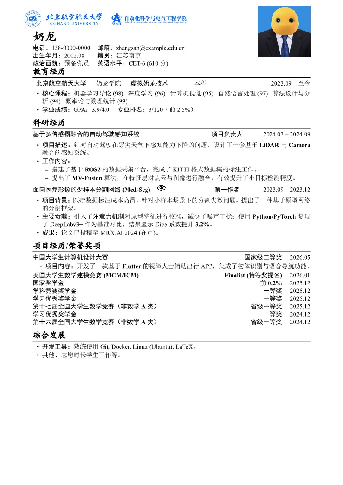
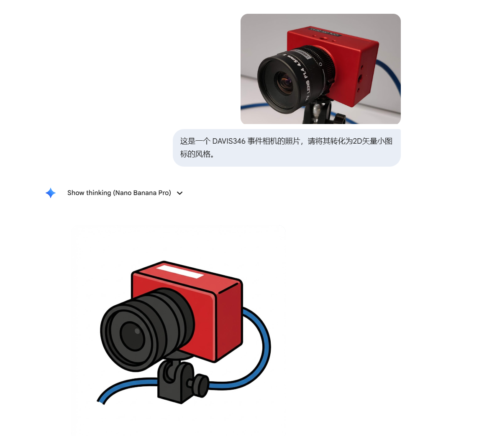
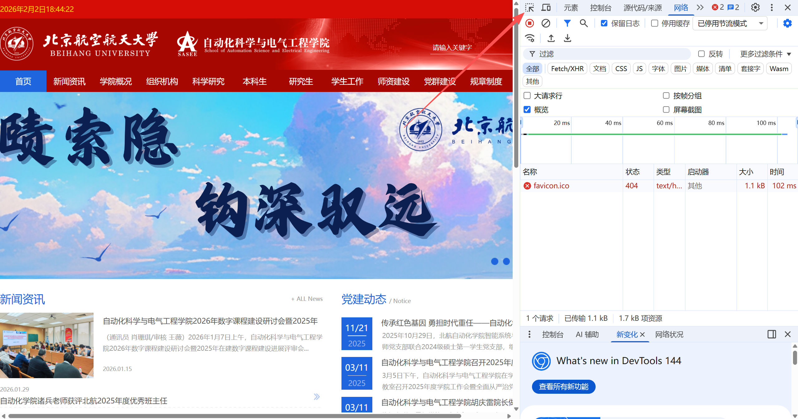
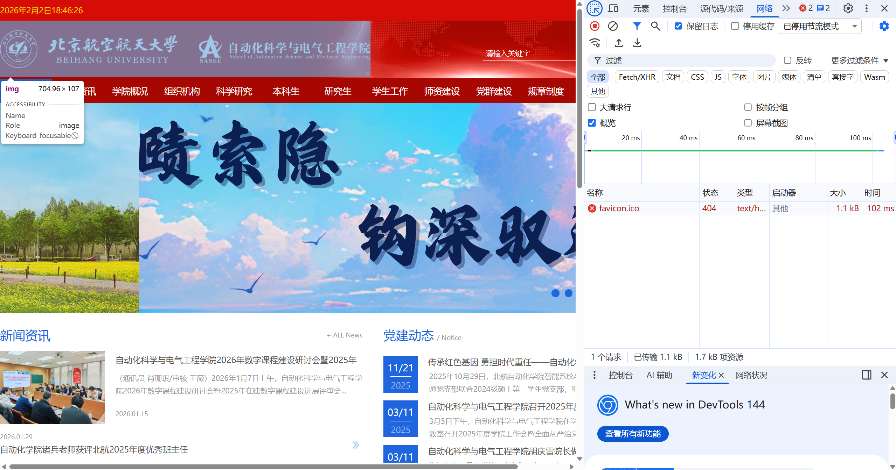
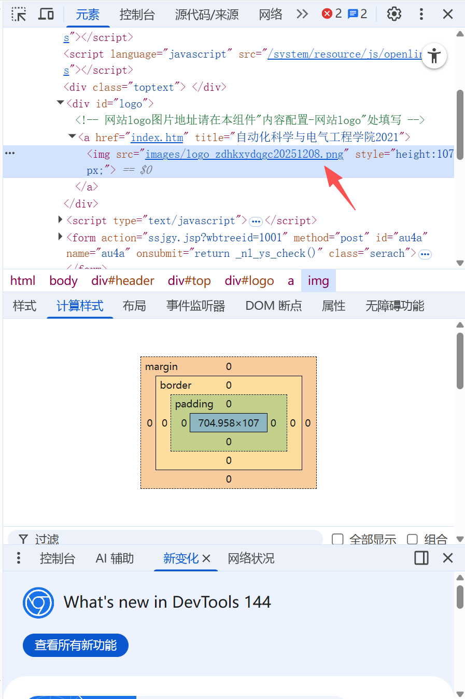
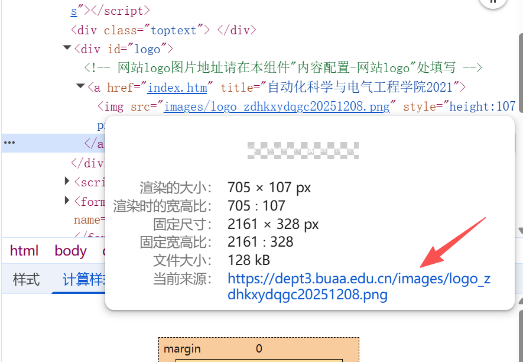
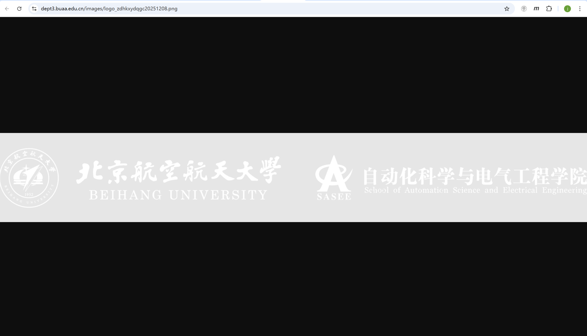
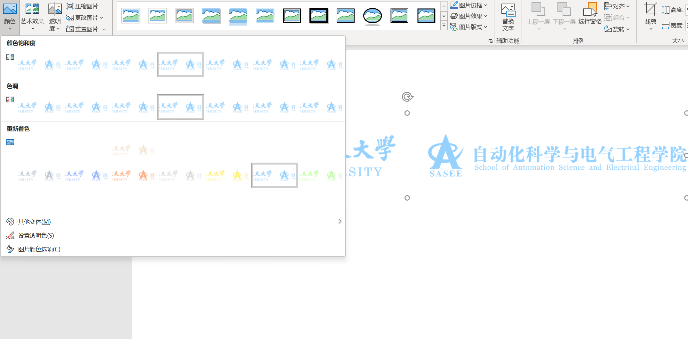

# BUAA-LaTeX-CV 中文推免简历模板使用教程

我们将帮助你快速上手这个 LaTeX 简历模板。即使你没有任何 LaTeX 基础，按照以下步骤操作也能生成一份排版精美的**推免简历**。


---

## 第一步：环境准备

### 使用 Overleaf
这是最简单的方式，无需安装任何软件。
1. 注册并登录 [Overleaf](https://www.overleaf.com)。
2. 点击 **"New Project"** -> **"Blank Project"**。
3. 将模板代码复制粘贴到左侧的 `main.tex` 文件中。
4. **关键设置**：点击左上角的 **"Menu"**，在 **"Compiler"** 选项中选择 **"XeLaTeX"** 。

### 本地安装
具体操作请参见B站内容，你可以搜索教学视频来完成本地 LaTeX 环境安装。
如果你想在本地电脑运行，一个常见的组合是：
* **Windows**: 安装 [TeX Live](https://tug.org/texlive/) + TeXstudio。
* **MacOS**: 安装 [MacTeX](https://tug.org/mactex/) + TeXShop 或 VS Code。
* **编译命令**: 必须使用 `XeLaTeX` 编译。

---

## 第二步：图片替换

这个模板默认需要两张图片。在编译前，你需要准备好图片并放到项目文件夹中（和 `.tex` 文件同级）。

1. **证件照**：
   - 找一张你的证件照，重命名为 `photo.jpg`。
   - 如果你的文件名不是这个，请在代码中搜索 `photo.jpg` 并修改文件名。
   - *不想放照片？* 注释掉 `\includegraphics` 那一行即可。

2. **院校Logo**：
   - 找一张透明背景的学校 Logo，重命名为 `logo.png`。
      - 如果你的文件名不是这个，请在代码中搜索 `logo.png` 并修改文件名。
   - *不想放 Logo？* 找到 `\placelogo` 命令定义处，注释掉 `\includegraphics` 那一行。

---

##  第三步：内容修改指南

### 1. 个人信息 (头部)
找到 `\begin{document}` 下方的内容：
- **姓名**：修改 `{\huge \kaishu \textbf{奶龙}}` 中的文字。
- **联系方式**：在 `tabular` 环境中修改电话、邮箱、籍贯等。

### 2. 教育经历
找到 `\section{教育经历}`。这里使用了一个特殊的表格布局：
```latex
\begin{tabular*}{\textwidth}{...}
    学校名称 & 学院 & 专业 & 学位 & 时间 \\
\end{tabular*}
```
- 直接替换对应的文字即可。
- 如果你的学校名字太长导致换行，可以尝试缩短专业名称，或者调整 `\hskip 1.5em` (列间距) 的数值。

### 3. 科研经历 
这个模板定义了一个极其方便的命令 `\projectitem`，格式如下：
```latex
\projectitem{项目名称}{你的角色}{时间段}
```
**示例修改**：
```latex
\projectitem{外卖配送路径优化系统}{核心开发者}{2024.01 -- 2024.06}
```
下面的具体内容使用 `itemize` (列表) 填写：
- `\item` 开头写主要描述。
- 可以嵌套 `itemize` 来写具体的细节（如“工作内容”下的子项）。

下面的这个操作**有些复杂**，不仅仅写了项目名称，还通过嵌套的方式，在项目名称后面加了一个可点击的小图标，可以**跳转到你设置的网站（比如你的github仓库）**，适合场景为**在PDF中直接点击查看你的项目链接**。
```
\projectitem{项目名\hspace{1em}\raisebox{-0.2em}{\href{www.baidu.com}{\includegraphics[height=1.5em]{eye.png}}}}{第一作者}{2023.09 -- 2023.12}
```
- 其中raisebox{-0.2em}的作用：把包裹的内容（这里是图标）在垂直方向上移动。（参数 -0.2em：负数表示向下移动。）下沉 0.2em 通常能让图标和文字在视觉上垂直居中。

- \href{www.baidu.com}{...}作用：创建超链接。为了保证跳转兼容性，建议网址加上协议头，例如 https://github.com/yourname。

- \includegraphics[height=1.5em]{eye.png} 作用：插入图片。
height=1.5em：强制设置图片高度（大小）。你可以调整参数来使得图标合适。

- eye.png：这是示例模板中图标的文件名，在我们的实践中为**矢量小图标**。你可以去搜索一些200x200（或其他）的合适的**矢量小图标**放到这里，为你的项目增色。

**小贴士**：使用 NanoBananaPro 等图片生成模型也可以生成你想要的**矢量小图标**。你可以使用**参照图**+**Prompt**的形式。比如下面这个例子：
```
这是一个 DAVIS346 事件相机的照片，请将其转化为2D矢量小图标的风格。
```

### 4. 项目经历/荣誉奖项
- **简单奖项**：使用 `\textbf{奖项名} \hfill \textbf{等级} \quad 时间` 的格式。
 `\hfill` 的作用是把左边的字顶在左边，右边的字顶在右边，自动填充中间空白。
- **复杂奖项**：有的时候你需要阐述一下比赛内容，你只需要在奖项下添加如下内容：
```
\begin{itemize}[nosep, leftmargin=2em, topsep=2pt]
		\item \textbf{项目内容：}我们开发了一款...
\end{itemize}
```

### 5. 技能列表
- 在 `\section{综合发展}` 中，修改 `\item` 后的内容即可。这里可以阐述你的个人技能，体育特长，学生工作，志愿服务等。

## 第四步：排版微调 

如果内容太多写不下，或者太少显得空，请按需修改以下参数：

### 1. 调整页边距 (变胖变瘦)
在代码最开头找到：
```latex
\usepackage[top=1.5cm, bottom=1.5cm, left=2cm, right=2cm]{geometry}
```
- **内容写不下时**：把 `1.5cm` 改成 `1.0cm`。
- **内容太少时**：把 `1.5cm` 改成 `2.0cm`。

### 2. 调整行间距 (变松变紧)
- **调整列表间距**：找到 `\setlist[itemize]...`，修改 `itemsep=1pt` (条目间距)。
- **调整标题间距**：找到 `\titlespacing*{\section}...`，修改 `{6pt}{4pt}` (段前/段后距)。

### 3. 调整 Mac 字体 (仅 Mac 用户)
如果你在 Mac 上编译报错或汉字不显示，请找到代码中的：
```latex
\setCJKmainfont[BoldFont=SimHei, ItalicFont=KaiTi]{SimSun}
```
将其注释掉（前面加 `%`），并取消下面这一行的注释：
```latex
\setCJKmainfont[BoldFont=Songti SC Bold, ItalicFont=Kaiti SC]{Songti SC}
```


### 4. 最简单的调整
如果你想快速调整不同行之间的距离，请使用：
```
\vspace{0.2em} %参数可以调整，负值代表缩小距离
```
如果你想**加粗**字体，请使用：
```
\textbf{重点词}
```
其余常见调整方法可以参见LLM的指导。

---


## 如何提取并优化高校/院系官网的高清Logo？

- 本项目自带了一个实现好的**“学校+院校” Logo**，其制作方法如下，大体上适用于各种学校学院的网站。下面将指导你如何从学校官网提取高清的透明背景 Logo（矢量图），并使用PPT快速制作一个用于简历上的 Logo。

###  准备工具
* **浏览器**：Chrome、Edge 等浏览器
* **软件**：Microsoft PowerPoint (PPT)

---

### 1. 打开开发者模式
1.  在浏览器中打开目标学院或学校的官方网站。
2.  按下键盘上的 **`F12`** 键（以打开浏览器的开发者工具面板。
3.  点击开发者工具面板左上角的 **“选取元素”图标**（通常是一个带箭头的方框图标）。如图红色箭头所示。



### 2. 定位 Logo 元素
1.  激活选取工具后，将鼠标移动到网页顶部的 **Logo 图片区域**。
2.  当看到 Logo 区域被蓝色遮罩高亮显示时，**点击左键**选中它。
3.  此时，右侧的代码面板会自动跳转并高亮显示该图片对应的 HTML 代码。



### 3. 找到图片链接
1.  在右侧高亮的代码行中（通常是 `` 标签），查找 `src` 属性。
2.  `src` 后面引号内的内容即为图片的相对路径或完整链接（例如：`images/logo_....png`）。



### 4. 获取高清原图
1.  将鼠标悬停在 `src` 链接上，直接点击该链接。
2.  浏览器会弹出一个网页，确认这就是我们要找的图片文件。



### 5. 验证并下载
直接在图片上**右键** -> **“图片另存为”**，将其保存到本地电脑。



### 6. Logo 重新着色
下载的透明/白色 Logo 在白底文档中无法显示，我们需要使用 PPT 进行简单的“魔法”处理：

1.  打开 **PowerPoint**，将刚才下载的图片拖入幻灯片。
2.  选中图片，点击顶部菜单栏的 **“图片格式” (Picture Format)**。
3.  点击 **“颜色” (Color)** 按钮。
4.  在下拉菜单的 **“重新着色”** 区域，选择一个你需要的颜色（例如：**蓝色**、黑色或学校的标准色）。
5.  **完成！** 现在你得到了一个高清、有颜色且背景透明的“学校+院系” Logo。（**你可以自己使用PPT的各种图片工具制作更加美观的 Logo**）



---
**小贴士：** 使用此方法提取的 Logo 通常是官网原始矢量或高清位图，清晰度远高于截图，非常适合用于学术海报、汇报PPT或简历排版。

## ❓ 常见问题 (Q&A)

**Q: 为什么生成的 PDF 中文全是方框 □□□？**
**A:** 99% 的情况是因为你没有选择 **XeLaTeX** 编译器。请参考第一步的设置。

**Q: 为什么照片位置很奇怪？**
**A:** 照片使用了 `minipage` (分栏) 布局。如果你左边的文字太长（比如名字特别长），会把右边的照片挤下去。并且证件照通常为2寸。
- **解决方法**：减小左侧宽度 `0.73\textwidth` 或减小右侧宽度 `0.24\textwidth`。

**Q: 如何导出 PDF？**
**A:** 在 Overleaf 中点击 "Recompile" 旁边的下载图标，或者点击 "Menu" -> "Download PDF"。如果是本地环境，通常会自动生成可阅览的 PDF。


## Star History

[](https://star-history.com/#aprlost/BUAA-LaTeX-CV&Date)
